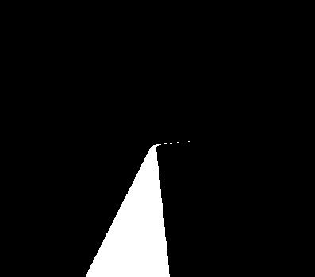

## Introducción
El objetivo de esta práctica es implementar un algoritmo de control reactivo para que el coche Formula 1 siga la línea roja situada en el centro del circuito. El coche lleva incorporada una cámara en la parte frontal que permitirá conocer la situación del coche con respecto a la línea roja y controlar su comportamiento. Por ello, primero será necesario procesar la imagen para posteriormente pasar la información extraída de la imagen al sistema de control que será el encargado de controlar el movimiento del Fórmula 1. 

Los tres criterios principales que tiene que cunmplir el sistema diseñado son los siguientes:
* **La velocidad.** El coche tiene que recorre el circuito en el menor tiempo posible, siendo aceptables tiempos inferiores al minuto. 
* **La seguridad**. El coche no debe perder la línea, tiene que oscilar lo menos posible y debe ir sobre la línea en medida de lo posible. 
* **Método de búsqueda**. Se debe incluir un método de búsqueda de la línea en caso de que el coche debe de ver la línea en algún momento o de que empiece en una posición donde no vea la línea. 

## Entorno de trabajo
Para la realización de la página se utilizará Robotics-Academy, y en concreto el entorno web unibotics.org. 
Los 2 comandos principales que permiten modificar el comportamiento del coche son los siguientes:
* **HAL.motors.sendV()** - Para ajustar la velocidad lineal
* **HAL.motors.sendW()** - Para ajustar la velocidad angular

Por otro lado, los comandos para extraer y visualizar las imágenes son:
* **HAL.getImage()** - Para obtener la imagen 
* **HAL.showImage()** - Para mostrar la imagen por pantalla

## Procesamiento de la imagen
El primer paso es umbralizar la imagen para quedarnos con la región que nos interesa, que en este caso es la línea roja. Los pasos que se han seguido son los siguientes:
* Convertir la imagen al espacio de color HSV. 
* Umbralizar la imagen en función de los rangos de valores que representan el color rojo en HSV. 

Un ejemplo de umbralización se puede ver en las siguientes imágenes:

 

# Prueba incluir vídeo 

# Prueba 2 vídeo
<iframe width="560" height="315" src="https://www.youtube.com/embed/CmMLGTU6Q5o" frameborder="0" allow="accelerometer; autoplay; clipboard-write; encrypted-media; gyroscope; picture-in-picture" allowfullscreen></iframe>

# Prueba incluir imagen

