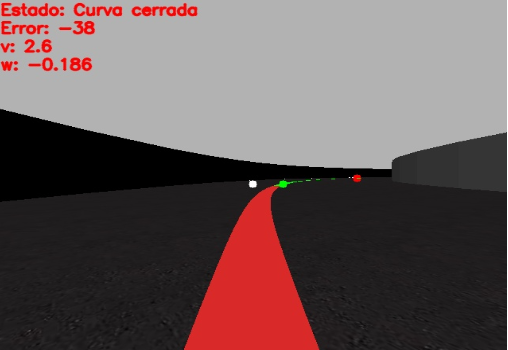

## Introducción
El objetivo de esta práctica es implementar un algoritmo de control reactivo para que el coche Formula 1 siga la línea roja situada en el centro del circuito. El coche lleva incorporada una cámara en la parte frontal que permitirá conocer la situación del coche con respecto a la línea roja y controlar su comportamiento. Por ello, primero será necesario procesar la imagen para posteriormente pasar la información extraída de la imagen al sistema de control que será el encargado de controlar el movimiento del Fórmula 1. 

Los tres criterios principales que tiene que cunmplir el sistema diseñado son los siguientes:
* **La velocidad.** El coche tiene que recorre el circuito en el menor tiempo posible, siendo aceptables tiempos inferiores al minuto. 
* **La seguridad**. El coche no debe perder la línea, tiene que oscilar lo menos posible y debe ir sobre la línea en medida de lo posible. 
* **Método de búsqueda**. Se debe incluir un método de búsqueda de la línea en caso de que el coche debe de ver la línea en algún momento o de que empiece en una posición donde no vea la línea. 

## Entorno de trabajo
Para la realización de la página se utilizará Robotics-Academy, y en concreto el entorno web unibotics.org. 
Los 2 comandos principales que permiten modificar el comportamiento del coche son los siguientes:
* **HAL.motors.sendV()** - Para ajustar la velocidad lineal
* **HAL.motors.sendW()** - Para ajustar la velocidad angular

Por otro lado, los comandos para extraer y visualizar las imágenes son:
* **HAL.getImage()** - Para obtener la imagen 
* **HAL.showImage()** - Para mostrar la imagen por pantalla

## Procesamiento de la imagen
El primer paso es umbralizar la imagen para quedarnos con la región que nos interesa, que en este caso es la línea roja. Los pasos que se han seguido son los siguientes:
* Convertir la imagen al espacio de color HSV. 
* Umbralizar la imagen en función de los rangos de valores que representan el color rojo en HSV. 

Un ejemplo de umbralización se puede ver en las siguientes imágenes:

 

Una vez que se ha umbralizado la imagen, y se tiene la línea roja segmentada, se han elegido un conjunto de 15 líneas consecutivas, en concreto de la línea 240 a la 255. De esta región de interés se ha calculado su centroide a partir del cálculo de momentos. El valor del centroide, en concreto el valor de la componente en *x*, se ha utilizado para el cálculo del error como se explicará en el siguiente apartado. 

 

Cabe mencionar que antes de seleccionar la región de interés comentada, se probó con otras regiones que abarcasen otro conjunto de filas, pero fue esta última con la que mejores resultados se obtuvo. 

Además, se ha calculado un punto en el horizonte, que corresponde al primer píxel blanco que se encuentra en la imagen umbralizada. Dicho punto servirá para: 
* Anticiparse a posibles curvas y tener tiempo de recación para frenar
* Accelerar al máximo cuando se detecte una recta

Utilizando la componente en *x* de dicho punto en el horizonte y el valor en *x* del centroide (cx) se ha definido la siguiente operación:
~~~
desviacion = abs(cx - px_horizonte)
~~~

Según el valor de la variable *desviacion* se han definido tres posibles situaciones en las que se puede encontrar el coche. Cada una de esas situaciones tiene asociada una velocidad lineal máxima a la que puede circular el coche. Así, si el coche se encuentra en una recta y detecta que se aproxima una curva, frena rápidamente mediante incrementos, y lo mismo en el caso contrario.

| Situación | Velocidad lineal (0-5) | Velocidad lineal (km/h) |
| :------: |:---: | :---: |
| Recta | 5 | 110 |
| Curva suave | 3.4 | 80 |
| Curva cerrada | 2.6 | 60 |

Dichos puntos se ven reflejados en la siguiente imagen siendo:
* **Punto blanco** --> Consigna
* **Punto verde** --> Centroide la región de interés
* **Punto rojo** --> Punto en el horizonte

 

.....

### Método de búsqueda
Como ya se ha comentado anteriormente, es necesario incorporar un método de búsqueda de la línea en caso de que ésta se pierda. Para ello es necesario:
* Saber que se ha perdido la línea. Esto implica que si no se ve la línea roja, la imagen umbralizada será totalmente negra, lo que significa que no se pueden calcular ni los contornos ni los momentos. 
* Girar en una dirección a una determinada velocidad angular constante y velocidad lineal nula, hacia la derecha por ejemplo, hasta que el número de contornos que se puedan calcular sea mayor que 0. 
* En ese momento, comenzar a acelerar y seguir la línea. 

En este caso particular, esta idea es perfectamente válida puesto que en el escenerio de simulación no existen otras zonas de color rojo que puedan confundir al algoritmo. 

<iframe width="560" height="315" src="https://www.youtube.com/embed/axlpD-IzmAM" frameborder="0" allow="accelerometer; autoplay; clipboard-write; encrypted-media; gyroscope; picture-in-picture" allowfullscreen></iframe>

### Prueba incluir vídeo 

### Prueba 2 vídeo

<iframe width="560" height="315" src="https://www.youtube.com/embed/CmMLGTU6Q5o" frameborder="0" allow="accelerometer; autoplay; clipboard-write; encrypted-media; gyroscope; picture-in-picture" allowfullscreen></iframe>

### Prueba incluir imagen

