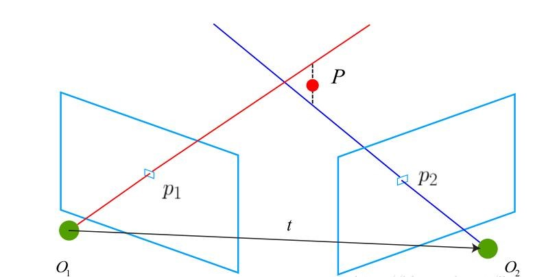

## Introducción
El objetivo de esta segunda práctica es programar un algoritmo que sea capaz de generar una reconstrucción 3D de la escena a partir de un par stereo de cámaras. Para la resolución de esta práctica será necesario entender y utilizar conceptos propios de la visión 3D, como son la geometría epipolar, la búsqueda de puntos homólogos, triangulación...

La escena que hay que reconstruir se muestra en la siguiente imagen:

 

De forma resumida, el procedimiento que se ha seguido para realizar la reconstrucción 3D ha sido el siguiente:

**1.** Extraer puntos de interés (bordes) de la imagen de la cámara izquierda. 

**2.** Para cada punto de interés se calcula el rayo de retroproyección y se proyecta sobre la imagen derecha, obteniéndose así la línea epipolar. 

**3.** Búsqueda del punto homólogo en la imagen derecha a lo largo de la línea epipolar (con algunas restricciones). 

**4.** Una vez que se tiene un punto en la imagen izquierda y su homólogo en la imagen derecha, se obtienen sus correspondientes rayos de retroproyección y se calcula la distancia mínima que hay entre ambas líneas, y de ahí el punto medio. 

**5.** Una vez se tiene ese punto de 'intersección', se dibuja dicho punto en la escena 3D. 

En los siguientes apartados se explicará con más detalle cada uno de los pasos que se han seguido para realizar la reconstrucción 3D. 

## Paso 1 - Extracción de puntos de interés

Los puntos que se van a reconstruir son aquellos que corresponden a los bordes de los distintos objetos de la escena. Con extraer los bordes de los distintos objetos será suficiente, ya que el objetivo es encontrar posibles obstáculos con los que se pueda encontrar el robot y no realizar una reconstrucción densa. 

Las imágenes capturadas por las dos cámaras tienen la siguiente forma:

 

Para la extracción de dichos puntos se ha utilizado el agoritmo de **detección de bordes de Canny**. 
A ambas imágenes antes de aplicarles Canny, se les ha aplicado un **filtrado bilateral** para eliminar puntos ruidosos del interior de los objetos. Además, a la imagen de la derecha se le ha aplicado una operación morfológica de dilatación para que existan más puntos sobres los que buscar el homólogo. 

 

## Paso 2 - Cálculo de la línea epipolar

Para cada punto de interés de la imagen izquierda es necesario calcular la correspondiente línea epipolar en la imagen derecha. Para ello, hay que retroproyectar el punto de interés al espacio 3D, y a partir de dicho punto 3D y el centro óptico de la cámara izquierda se obtiene la dirección del rayo de retroproyección. Extrayendo dos puntos de dicho rayo y proyectándolos en la imagen derecha se obtiene la **línea epipolar**. Esta idea se representa de la siguiente forma:

 

## Paso 3 - Búsqueda de puntos homólogos

La búsqueda del punto homólogo de un determinado punto de la imagen de izquierda se hará sobre la línea epipolar. Por la forma en que están colocadas las cámaras se pueden incluir dos restricciones que reducen el cómputo númerico:

- Para una búsqueda eficiente del punto homólogo no se recorrerá toda la línea epipolar sino que se definirá un rango máximo de búsqueda, es decir, un número máximo de píxeles a recorrer. 
- El punto homólogo a un punto (x1, y1) de la imagen izquierda se encontrará siempre a la izquierda de dicho punto, nunca a la derecha, debido a la configuración de las cámaras. Esto hace que la búsqueda del punto homólogo se haga sólo hacia la izquierda de un punto (x1, y1) un determinado número de píxeles. 

Para calcular la similitud entre un parche de la imagen izquierda y los distintos parches de la línea epipolar de la imagen derecha se ha utilizado el Error Cuadrático Medio o Mean Squared Error (MSE), cuya ecuación es la siguiente:

 

Así, el parche de la imagen izquierda se va comparando con los distintos parches de la imagen derecha sobre la línea epipolar, y aquel con el que el MSE sea menor, será considerado como el punto homólogo. Además, también se ha definido un valor máximo de MSE, de forma que el punto homólogo calculado será tenido en cuenta si y solo si no supera dicho valor máximo de MSE. 

Algunas parejas de puntos se muestran en la siguiente imagen: 

 

## Paso 4 - Triangulación

A partir de un punto en la imagen izquierda y su homólogo en la imagen derecha se puede obtener su correspondiente punto 3D en la escena mediane **triangulación**. La triangulación consiste en retroproyectar ambos puntos al espacio 3D, obteniéndose así sus correspondientes rayos de retroproyección. El punto 3D sería el punto de intersección entre ambos rayos pero, por lo general, dichos rayos no suelen cortarse, por lo que se calcula la línea más corta que une ambas líneas, siendo el punto medio de esa línea el punto 3D que se busca. Para el cálculo de la línea más corta que hay entre dos líneas en 3D se ha utilizado el método escrito por Paul Bourke, que puede encontrarse en el siguiente [enlace](http://paulbourke.net/geometry/pointlineplane/). 

En la siguiente imagen se muestra un ejemplo genérico de la triangulación realizada para un par de puntos, donde P representa el punto medio de la línea más corta que une los dos rayos de retroproyección:

 

## Resultados y Conclusiones

En el siguiente vídeo se muestra el proceso de reconstrucción 3D (acelerado a x2):

<iframe width="560" height="315" src="https://www.youtube.com/embed/1URLaxHp9x0" title="YouTube video player" frameborder="0" allow="accelerometer; autoplay; clipboard-write; encrypted-media; gyroscope; picture-in-picture" allowfullscreen></iframe>

El siguiente vídeo muestra la profundidad de la reconstrucción desde distintos ángulos:

<iframe width="560" height="315" src="https://www.youtube.com/embed/KA9kNLIjogQ" title="YouTube video player" frameborder="0" allow="accelerometer; autoplay; clipboard-write; encrypted-media; gyroscope; picture-in-picture" allowfullscreen></iframe>

Una comparativa entre la escena simulada y la reconstrucción 3D:

 

 

Como puede comprobarse, la reconstrucción de los distintos objetos es la correcta ya que, por ejemplo, los cubos de la derecha son los que más cerca de la cámara se han reconstruido, la figura de Mario está situada por delante de la de Luigi, el pato está por delante de la caja de cereales..., tal y como en la escena simulada.

Con la realización de práctica se ha conseguido afianzar los conocimientos adquiridos durante el curso sobre reconstrucción 3D, aprendiendo a reconstruir una escena a partir de un par stereo de imágenes. El algoritmo desarrollado podría mejorarse incluyendo paralelización para hacer que la reconstrucción se haga en un menor tiempo ya que tal y como está desarrollado sería imposible utilizarlo para una aplicación en tiempo real. Además habría que refinar el algoritmo para eliminar puntos espúreos que se crean por la escena. Aún así, se ha conseguido una construcción 3D bastante aceptable que permitiría al robot navegar por la escena. 

